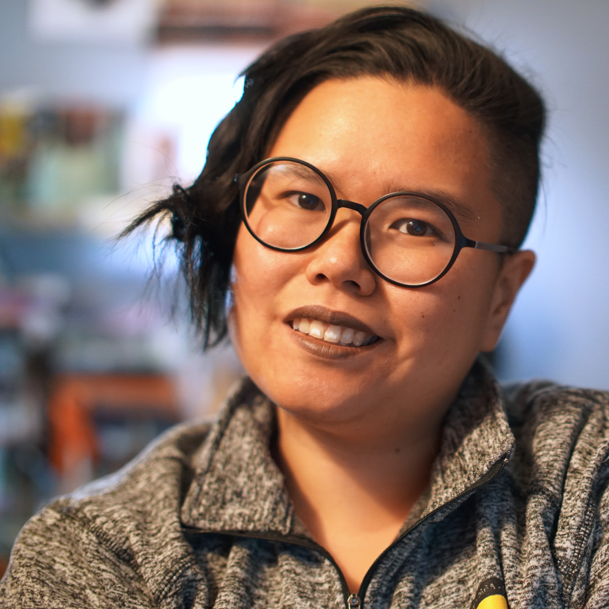

<h1>About Me</h1>

{: style="float: right; width: 200px; padding: 0 0 25px 25px"}

Hello! I'm Maria (she/her). I'm a queer ~.75 gen (or whatever it's called when you immigrate as a baby, spend too many years assimilating and now get to spend more years unlearning many things) Filipino-American currently living in the Midwest with my partner and our cat, Lotus. I studied mathematical computational biology in my undergraduate years before pursuing a PhD in Microbiology. Currently, I do some remote research support involving antibiotic resistance genes, but my love of marine microbes, fundamental microbiology, and ocean biochemistry still lingers.

My main interests (and probably what I'll talk about most) are books and tabletop roleplaying games, but I have too many hobbies and a propensity to throw myself into new things to be enthusiastic about. I dabble in sewing, fiber arts (knitting and crocheting), dice making, ceramics, photography, writing, and woodturning. I get very excited about TV shows! I permanently speak with an exclamation mark after everything I say!

You can find me on Twitter [@yayforbooks](https://twitter.com/yayforbooks) (for now), where I am probably fangirling about books, games, dramas, art... anything, really. 