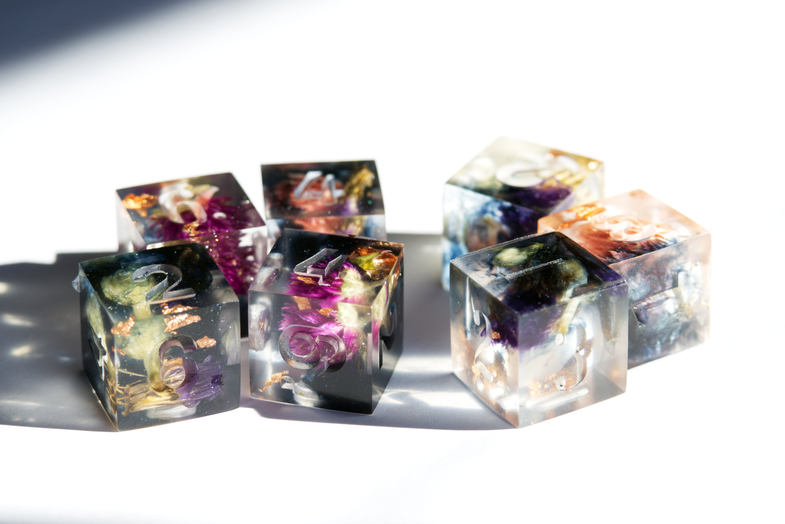

<h1>My Work</h1>

{: style="float: left; max-width: 20%; padding: 0 50px 0 0"}
* My game design work is found at my [itch.io](http://yayforbooks.itch.io) page. Right now my supplemental Skin for Monsterhearts 2, [the Swan](https://yayforbooks.itch.io/the-swan-mh2-skin), is available.
* I turned a playthrough of [Anamnesis](https://blinkingbirchgames.itch.io/anamnesis) by [Blinking Birch Games](https://itch.io/profile/blinkingbirchgames) into [a twine game](/Genesis_Enhancement_Protocol__Stage_1.html)! This playthrough was inspired by a character I played in a run of a Mecha hack of the game [Good Society](https://storybrewersroleplaying.com/good-society/?v=7516fd43adaa).
* There are some videos (and playthroughs I should finish one day...) on my [YouTube channel](https://www.youtube.com/user/yayforbooks).

